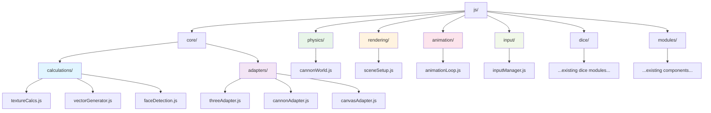
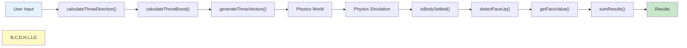
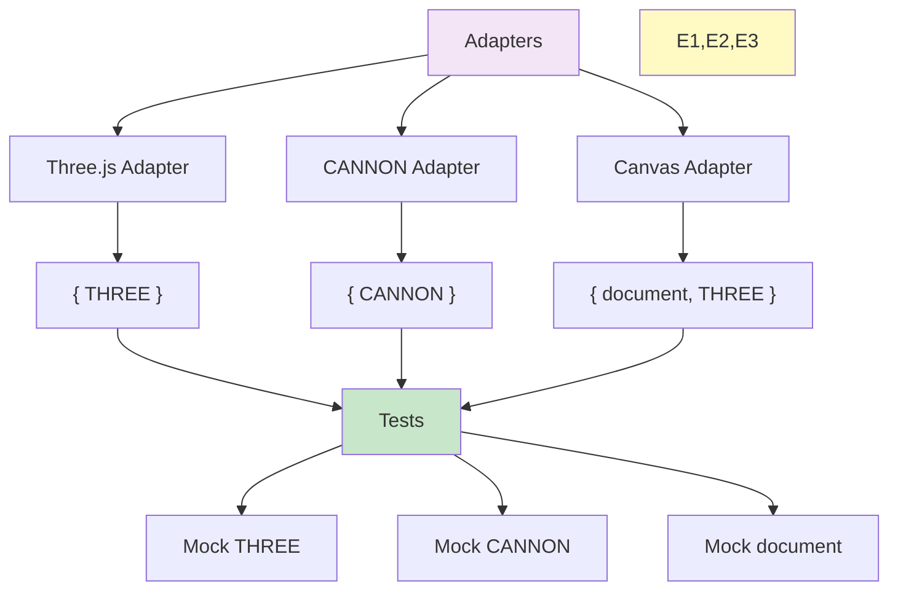
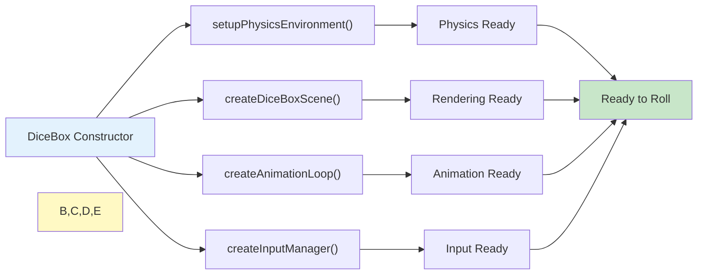
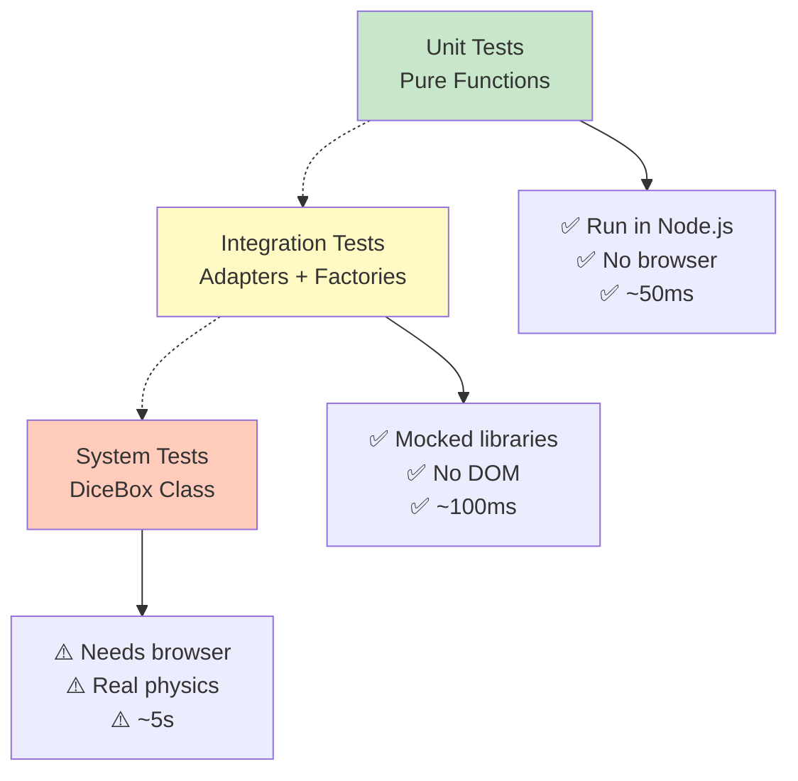

# Die-Hard-Dice Modularization Guide

## Table of Contents
1. [Architecture Overview](#architecture-overview)
2. [Module Structure](#module-structure)
3. [Pure Functions](#pure-functions)
4. [Adapters & Dependency Injection](#adapters--dependency-injection)
5. [Factory Functions](#factory-functions)
6. [Usage Examples](#usage-examples)

---

## Architecture Overview

This guide describes the new modular architecture created to improve testability, maintainability, and debugging of the dice.js codebase.

### Design Principles

- **Pure Functions**: No side effects, deterministic output
- **Dependency Injection**: External libraries injected as parameters
- **Single Responsibility**: Each module has one clear purpose
- **Independent Testability**: Each module can be tested in isolation
- **Documentation**: Comprehensive JSDoc with examples

---

## Module Structure

### Directory Hierarchy



---

## Pure Functions

### js/core/calculations/

Pure mathematical and data transformation functions with **zero dependencies**.

#### textureCalcs.js

```javascript
// Calculate nearest power of 2 for GPU texture sizes
calcNearestPowerOf2(approx) → number

// Calculate texture rendering parameters
calculateTextureParams(text, baseSize, margin) → Object
  → { textureSize, fontSize, trimmedText, shouldAddDot, textWidth }

// Build rendering instructions
buildTextureRenderInstructions(text, textColor, bgColor, size, margin) → Object
  → { width, height, backgroundColor, textRender: {...} }

// Validate texture size stays within acceptable range
validateTextureSize(size, min, max) → number
```

#### vectorGenerator.js

```javascript
// Apply random rotation to direction vector
makeRandomVector(vector, randomFn) → { x, y }

// Calculate initial position in grid layout
calculateDicePosition(index, gridSize, spacing) → { x, y, z }

// Calculate velocity from direction and boost
calculateThrowVelocity(direction, boost, variance, randomFn) → { x, y, z }

// Calculate angular velocity for tumbling effect
calculateAngularVelocity(velocity, spinFactor, randomFn) → { x, y, z }

// Generate all throw parameters for multiple dice
generateThrowVectors(diceTypes, direction, boost) → Array<{type, pos, velocity, angle, axis}>

// Calculate boost factor from drag distance
calculateThrowBoost(dragDistance, maxDistance, maxBoost) → number

// Calculate throw direction from drag gesture
calculateThrowDirection(dragStart, dragEnd) → { x, y, distance }
```

#### faceDetection.js

```javascript
// Determine which face is pointing up
detectFaceUp(quaternion, faceNormals, numFaces) → number

// Get numeric value from face
getFaceValue(diceObj, faceIndex, diceType) → number|string

// Check if physics body has stopped moving
isBodySettled(body, linearThreshold, angularThreshold) → boolean

// Parse single result value
parseResultValue(result) → number

// Sum array of results
sumResults(results) → number

// Check if all dice have settled
checkAllDiceSettled(diceObjects, linearThreshold, angularThreshold) → boolean
```

### Pure Functions Data Flow



---

## Adapters & Dependency Injection

### Core Concept

All adapters use dependency injection to enable testing without libraries.

```javascript
// Production: use real libraries
const adapter = createThreeAdapter({ THREE: window.THREE });

// Testing: use mock implementations
const mockThree = { /* mock */ };
const testAdapter = createThreeAdapter({ THREE: mockThree });

// Same code, different implementations!
```

### js/core/adapters/

#### threeAdapter.js

Creates all Three.js objects with injected library dependency.

```javascript
createThreeAdapter(deps) → {
  createScene(),
  createCamera(config),
  createRenderer(config),
  configureShadows(renderer, config),
  createAmbientLight(color, intensity),
  createSpotLight(color, intensity, config),
  configureLightShadows(light, config),
  createPlaneGeometry(width, height, ...),
  createMaterial(config),
  createMesh(geometry, material),
  configureMeshShadows(mesh, config)
}

createThreeVector(deps, vec) → THREE.Vector3
createThreeQuaternion(deps, quat) → THREE.Quaternion
```

#### cannonAdapter.js

Creates all CANNON.js physics objects with injected library dependency.

```javascript
createCannonAdapter(deps) → {
  createDiceBody(mass, material),
  createConvexShape(vertices, faces),
  createPlaneShape(),
  createMaterial(name),
  createContactMaterial(mat1, mat2, properties),
  createWorld(config),
  setBodyTransform(body, pos, rot),
  setBodyVelocity(body, velocity, angularVel)
}

createCannonVector(deps, vec) → CANNON.Vec3
createCannonQuaternion(deps, quat) → CANNON.Quaternion
```

#### canvasAdapter.js

Handles canvas rendering operations with injected DOM dependency.

```javascript
createCanvasAdapter(deps) → {
  createCanvas(width, height),
  renderTextOnCanvas(canvas, instructions),
  getCanvasImageData(canvas)
}

createThreeTextureAdapter(deps) → {
  createTextureFromCanvas(canvas),
  createMaterialFromTexture(texture, options)
}

renderTextToThreeTexture(text, textColor, bgColor, instructions, deps)
  → THREE.Texture
```

### Adapter Dependency Graph



---

## Factory Functions

### js/physics/cannonWorld.js

Complete physics world initialization and configuration.

```javascript
// Create physics world with gravity and solver
createPhysicsWorld(deps, config) → CANNON.World

// Create material definitions
createPhysicsMaterials(deps) → { dice, desk, barrier }

// Define collision behavior between materials
createContactMaterial(deps, mat1, mat2, properties) → CANNON.ContactMaterial

// Register all material interactions in world
registerContactMaterials(deps, world, materials, config) → void

// Create ground plane
createGroundPlane(deps, world, material) → CANNON.Body

// Create individual barrier wall
createBarrier(deps, world, material, axis, angle, position) → CANNON.Body

// Create all 4 boundaries (top, bottom, left, right)
createAllBarriers(deps, world, material, width, height) → Array<CANNON.Body>

// Complete setup in one call
setupPhysicsEnvironment(deps, width, height, config)
  → { world, materials, ground, barriers }
```

### js/rendering/sceneSetup.js

Three.js scene, camera, and renderer initialization.

```javascript
// Create complete scene with camera, renderer, lights, ground
createDiceBoxScene(deps, container, config)
  → { scene, camera, renderer, light, ground, dimensions }

// Update scene for responsive resizing
resizeDiceBoxScene(deps, setup, container, config) → void

// Create visual debug barriers for development
createDebugVisualBarriers(deps, scene, width, height) → Array<THREE.Mesh>

// Remove all dynamic meshes from scene
clearSceneMeshes(scene, excludeMeshes) → number

// Render single frame
renderScene(renderer, scene, camera) → void
```

### js/animation/animationLoop.js

Physics simulation and rendering loop management.

```javascript
// Configuration constants
animationConfig = {
  frameRate: 1/60,
  useAdaptiveTimestep: true,
  maxTimestep: 0.05,
  selectorRotationSpeed: 0.01
}

// Sync physics body to Three.js mesh
syncMeshToBody(mesh, body) → void

// Run single physics simulation step
stepPhysics(world, meshes, timestep) → void

// Create animation loop controller
createAnimationLoop(config) → {
  start() → Function,
  stop() → void,
  isRunning() → boolean,
  stepOnce(timestep) → void
}

// Create selector rotation animation
createSelectorAnimationLoop(config) → {
  start() → Function,
  stop() → void,
  isRunning() → boolean
}

// Pause, step manually, resume
pauseAndStep(animationLoop, steps, timestep) → void
```

### js/input/inputManager.js

User interaction handling (mouse, touch, buttons).

```javascript
// Raycast to find dice at screen position
raycastDice(config) → THREE.Mesh | null

// Convert screen coordinates to normalized device coordinates
normalizeMouseCoords(screenX, screenY, canvasWidth, canvasHeight) → { x, y }

// Extract position from mouse or touch event
getEventPosition(event) → { x, y } | null

// Track drag gestures
createDragHandler(config) → {
  start() → void,
  stop() → void,
  isDragging() → boolean,
  getDragStart() → Object | null
}

// Handle throw button clicks
createButtonThrowHandler(config) → {
  attach() → void,
  detach() → void
}

// Complete input manager
createInputManager(config) → {
  attach() → void,
  detach() → void,
  getDiceAtPosition(screenX, screenY) → THREE.Mesh | null
}
```

### Factory Functions Flow



---

## Usage Examples

### Example 1: Pure Calculation (Node.js Compatible)

```javascript
import { generateThrowVectors } from './js/core/calculations/vectorGenerator.js';

const vectors = generateThrowVectors(
  ['d6', 'd6', 'd20'],      // dice types
  { x: 1, y: 0 },            // throw direction
  2.0,                        // boost factor
  4,                          // grid size
  50,                         // spacing
  Math.random                 // can be mocked!
);

// Returns: Array of throw parameters ready for physics
console.log(vectors[0].velocity);  // { x, y, z }
console.log(vectors[0].pos);       // { x, y, z }
```

### Example 2: Adapter with Dependency Injection

```javascript
import { createThreeAdapter } from './js/core/adapters/threeAdapter.js';

// Production code
const adapter = createThreeAdapter({ THREE: window.THREE });
const scene = adapter.createScene();

// Testing code - same function, different dependency!
const mockThree = {
  Scene: class {},
  Camera: class {},
  // ... mock implementation
};
const testAdapter = createThreeAdapter({ THREE: mockThree });
```

### Example 3: Complete Physics Setup

```javascript
import { setupPhysicsEnvironment } from './js/physics/cannonWorld.js';

const physics = setupPhysicsEnvironment(
  { CANNON },
  300,   // visible area width
  200,   // visible area height
  { gravityScale: 800, solverIterations: 16 }
);

// Returns: { world, materials, ground, barriers }
physics.world.step(1/60);  // One simulation frame
```

### Example 4: Animation Loop

```javascript
import { createAnimationLoop } from './js/animation/animationLoop.js';

const animLoop = createAnimationLoop({
  renderer,
  scene,
  camera,
  world,
  meshes: diceMeshes,
  onFrame: (frameData) => {
    console.log(`FPS: ${1 / frameData.deltaTime}`);
  }
});

// Start rendering
const stop = animLoop.start();

// Stop when done
stop();
```

### Example 5: Input Management

```javascript
import { createInputManager } from './js/input/inputManager.js';

const inputMgr = createInputManager({
  container,
  throwButton,
  camera,
  meshes: diceMeshes,
  onThrow: (params) => {
    console.log('Throwing:', params.direction, params.boost);
    performThrow(params);
  },
  onDiceSelect: (dice) => {
    console.log('Selected:', dice);
  }
});

inputMgr.attach();
// ... later
inputMgr.detach();
```

---

## Testing Strategy

### Test Pyramid



### Test Coverage

| Layer | Functions | Testable | Speed |
|-------|-----------|----------|-------|
| Pure Calculations | 11 | 100% | Fast |
| Adapters | ~25 | 100% | Fast |
| Factories | ~16 | 100% | Fast |
| DiceBox | 1 | ~80% | Slow |
| **TOTAL** | **~62** | **>95%** | Mixed |

---

## Next Steps

The main `js/dice.js` file will be refactored to:

1. Import all new modules
2. Use factories instead of manual setup
3. Delegate to adapters for library operations
4. Maintain backward compatibility through re-exports
5. Reduce from 1,754 → ~400-500 lines

**Status**: Phase 1 (Module Creation) ✅ Complete  
**Pending**: Phase 2 (dice.js Refactoring)
