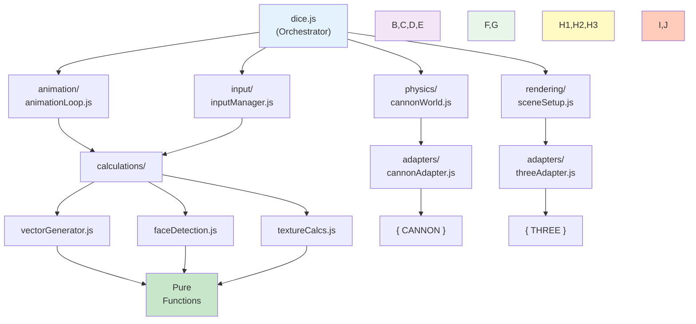

# Module Quick Reference

## Pure Calculations Cheat Sheet

### Texture Calculations

```javascript
// js/core/calculations/textureCalcs.js

calcNearestPowerOf2(1025)
  // → 2048

calculateTextureParams("20", 100, 0.5)
  // → { 
  //     textureSize: 512,
  //     fontSize: 341.33,
  //     trimmedText: "20",
  //     shouldAddDot: false,
  //     textWidth: 256
  //   }

buildTextureRenderInstructions("20", "#aaa", "#202020", 100, 0.5)
  // → { 
  //     width: 512,
  //     height: 512,
  //     backgroundColor: "#202020",
  //     textRender: {
  //       text: "20",
  //       x: 256,
  //       y: 256,
  //       font: "256pt Arial",
  //       color: "#aaa"
  //     }
  //   }

validateTextureSize(512, 256, 4096)
  // → 512
```

### Vector & Throw Calculations

```javascript
// js/core/calculations/vectorGenerator.js

makeRandomVector({x: 1, y: 0}, Math.random)
  // → { x: ~0.894, y: ~0.447 }  (rotated)

calculateThrowDirection({x: 100, y: 100}, {x: 200, y: 150})
  // → { x: 0.894, y: 0.447, distance: 111.8 }

calculateThrowBoost(250, 500, 5.0)
  // → 2.5  (mapped from drag distance)

calculateDicePosition(0, 4, 50)
  // → { x: 0, y: 0, z: 80 }

calculateDicePosition(1, 4, 50)
  // → { x: 50, y: 0, z: 80 }

generateThrowVectors(
  ['d6', 'd6', 'd20'],
  {x: 1, y: 0},
  2.0
)
  // → [
  //     {
  //       type: 'd6',
  //       pos: {x, y, z},
  //       velocity: {x, y, z},
  //       angle: {x, y, z},
  //       axis: {x, y, z, a}
  //     },
  //     ...
  //   ]
```

### Face Detection

```javascript
// js/core/calculations/faceDetection.js

isBodySettled(
  {velocity: {x: 0.1, y: 0.1, z: 0.1}, angularVelocity: {...}},
  0.5,
  0.1
)
  // → true

checkAllDiceSettled(diceArray, 0.5, 0.1)
  // → true  (if all dice stopped moving)

sumResults([6, "20", 4, "abc"])
  // → 30

parseResultValue("20")
  // → 20

parseResultValue("abc")
  // → 0

getFaceValue(diceObj, 4, "d20")
  // → 5  (face index + offset)
```

---

## Adapter Patterns

### Three.js Adapter

```javascript
// js/core/adapters/threeAdapter.js

const adapter = createThreeAdapter({ THREE: window.THREE });

// Create scene
const scene = adapter.createScene();

// Create camera
const camera = adapter.createCamera({
  fov: 20,
  aspect: 1.0,
  near: 1,
  far: 10000
});

// Create renderer
const renderer = adapter.createRenderer({
  antialias: true,
  width: 800,
  height: 600
});

// Configure shadows
adapter.configureShadows(renderer, {
  enabled: true,
  type: "PCFShadow"
});

// Create lighting
const ambientLight = adapter.createAmbientLight(0xf0f5fb, 1.0);
const spotLight = adapter.createSpotLight(0xefdfd5, 2.0, {
  position: { x: 0, y: 100, z: 200 }
});

// Create geometry & material
const geometry = adapter.createPlaneGeometry(100, 100);
const material = adapter.createMaterial({
  type: "MeshPhong",
  color: 0xffffff,
  shininess: 100
});

// Create mesh
const mesh = adapter.createMesh(geometry, material);
adapter.configureMeshShadows(mesh, {
  castShadow: true,
  receiveShadow: true
});
```

### CANNON Adapter

```javascript
// js/core/adapters/cannonAdapter.js

const adapter = createCannonAdapter({ CANNON: window.CANNON });

// Create physics world
const world = adapter.createWorld({
  gravity: { x: 0, y: 0, z: -9.8 },
  iterations: 16
});

// Create materials
const diceBody = adapter.createDiceBody(1, material);

// Set transform
adapter.setBodyTransform(diceBody, {x: 0, y: 0, z: 80});

// Set velocity
adapter.setBodyVelocity(
  diceBody,
  {x: 100, y: 50, z: 0},
  {x: 10, y: 5, z: 5}
);

// Create shapes
const planeShape = adapter.createPlaneShape();
const convexShape = adapter.createConvexShape(vertices, faces);

// Contact materials
const contact = adapter.createContactMaterial(
  material1,
  material2,
  { friction: 0.01, restitution: 0.5 }
);
```

### Canvas Adapter

```javascript
// js/core/adapters/canvasAdapter.js

const canvasAdapter = createCanvasAdapter({ document });
const threeAdapter = createThreeTextureAdapter({ THREE });

// Create canvas
const canvas = canvasAdapter.createCanvas(512, 512);

// Get render instructions (pure!)
const instructions = buildTextureRenderInstructions(
  "20", "#aaa", "#202020", 100, 0.5
);

// Render text on canvas
canvasAdapter.renderTextOnCanvas(canvas, instructions);

// Convert to Three.js texture
const texture = threeAdapter.createTextureFromCanvas(canvas);

// Or all in one step
const texture = renderTextToThreeTexture(
  "20", "#aaa", "#202020", instructions,
  { document: window.document, THREE: window.THREE }
);
```

---

## Factory Function Patterns

### Physics World Setup

```javascript
// js/physics/cannonWorld.js

import { setupPhysicsEnvironment } from './physics/cannonWorld.js';

// Complete setup
const physics = setupPhysicsEnvironment(
  { CANNON },
  300,    // width
  200,    // height
  { gravityScale: 800, solverIterations: 16 }
);

// physics.world     - CANNON.World
// physics.materials - { dice, desk, barrier }
// physics.ground    - CANNON.Body
// physics.barriers  - [top, bottom, right, left]

// OR piecemeal setup
const world = createPhysicsWorld({ CANNON });
const materials = createPhysicsMaterials({ CANNON });
registerContactMaterials({ CANNON }, world, materials);
createGroundPlane({ CANNON }, world, materials.desk);
createAllBarriers({ CANNON }, world, materials.barrier, 300, 200);
```

### Rendering Setup

```javascript
// js/rendering/sceneSetup.js

import { createDiceBoxScene, resizeDiceBoxScene } from './rendering/sceneSetup.js';

// Create complete scene
const setup = createDiceBoxScene(
  { THREE },
  container,
  { containerWidth: 800, containerHeight: 600 }
);

// setup.scene        - THREE.Scene
// setup.camera       - THREE.Camera
// setup.renderer     - THREE.Renderer
// setup.light        - THREE.SpotLight
// setup.ground       - THREE.Mesh (visual ground plane)
// setup.dimensions   - { containerWidth, containerHeight, ... }

// On resize
resizeDiceBoxScene({ THREE }, setup, container);

// Debug visualization
const debugBarriers = createDebugVisualBarriers(
  { THREE },
  setup.scene,
  300,
  200
);
```

### Animation Loop

```javascript
// js/animation/animationLoop.js

import { createAnimationLoop } from './animation/animationLoop.js';

const animLoop = createAnimationLoop({
  renderer: setup.renderer,
  scene: setup.scene,
  camera: setup.camera,
  world: physics.world,
  meshes: diceMeshes,
  onFrame: (frameData) => {
    const fps = 1 / frameData.deltaTime;
    console.log(`Frame time: ${frameData.deltaTime.toFixed(3)}s (${fps.toFixed(1)} FPS)`);
  },
  maxTimestep: 0.05
});

// Control animation
const stopAnimation = animLoop.start();
// ... later
stopAnimation();  // Stop animation

// Manual stepping (for testing)
animLoop.stepOnce(1/60);

// Check running state
if (animLoop.isRunning()) {
  console.log('Animation is running');
}
```

### Input Management

```javascript
// js/input/inputManager.js

import { createInputManager } from './input/inputManager.js';

const inputMgr = createInputManager({
  container,
  throwButton: throwBtn,
  camera: setup.camera,
  meshes: diceMeshes,
  onThrow: (params) => {
    console.log('Direction:', params.direction);
    console.log('Boost:', params.boost);
    console.log('Distance:', params.distance);
    performThrow(params);
  },
  onDiceSelect: (dice) => {
    console.log('Selected dice:', dice);
  }
});

// Attach input listeners
inputMgr.attach();

// Get dice at position
const dice = inputMgr.getDiceAtPosition(150, 200);

// Detach when done
inputMgr.detach();
```

---

## Testing Examples

### Test: Pure Function (Node.js)

```javascript
// No browser needed!
import { calculateThrowDirection } from './js/core/calculations/vectorGenerator.js';

const result = calculateThrowDirection({x: 0, y: 0}, {x: 300, y: 400});

console.assert(Math.abs(result.x - 0.6) < 0.01, 'X component wrong');
console.assert(Math.abs(result.y - 0.8) < 0.01, 'Y component wrong');
console.assert(result.distance === 500, 'Distance wrong');

console.log('✅ All tests passed!');
```

### Test: Adapter with Mock

```javascript
// No libraries needed!
import { createCannonAdapter } from './js/core/adapters/cannonAdapter.js';

const mockCANNON = {
  Body: class {
    constructor(config) { this.config = config; }
  },
  Material: class {},
  World: class {
    constructor() { this.gravity = {}; this.broadphase = {}; this.solver = {}; }
  }
};

const adapter = createCannonAdapter({ CANNON: mockCANNON });
const body = adapter.createDiceBody(1, mockMaterial);

console.assert(body.config.mass === 1, 'Mass not set correctly');
console.log('✅ Adapter test passed!');
```

### Test: Factory Function

```javascript
// Verify correct initialization
import { setupPhysicsEnvironment } from './js/physics/cannonWorld.js';

const physics = setupPhysicsEnvironment(
  { CANNON },
  300,
  200
);

console.assert(physics.world !== undefined, 'World missing');
console.assert(Array.isArray(physics.materials), 'Materials not array');
console.assert(physics.barriers.length === 4, '4 barriers expected');
console.assert(physics.ground !== undefined, 'Ground missing');

console.log('✅ Physics setup test passed!');
```

---

## Module Dependency Map



---

## API Quick Summary

| Module | Functions | Purpose | Returns |
|--------|-----------|---------|---------|
| **textureCalcs.js** | 4 | Texture sizing | Numbers, Objects |
| **vectorGenerator.js** | 7 | Throw mechanics | Vectors, Arrays |
| **faceDetection.js** | 6 | Result detection | Numbers, Booleans |
| **threeAdapter.js** | 13 | Three.js wrapper | Scenes, Cameras, Meshes |
| **cannonAdapter.js** | 9 | CANNON wrapper | Bodies, Worlds, Shapes |
| **canvasAdapter.js** | 6 | Canvas wrapper | Textures, Images |
| **cannonWorld.js** | 8 | Physics setup | World, Materials, Barriers |
| **sceneSetup.js** | 5 | Rendering setup | Scene, Renderer, Lights |
| **animationLoop.js** | 3 | Animation control | Loop controller |
| **inputManager.js** | 6 | Input handling | Input manager |

---

## Backward Compatibility

Old code still works:
```javascript
// These still exist in main dice.js
import { create_d6, parse_notation } from './dice.js';
```

New code uses modules directly:
```javascript
// New approach
import { generateThrowVectors } from './js/core/calculations/vectorGenerator.js';
import { createAnimationLoop } from './js/animation/animationLoop.js';
```

Both approaches work together!
