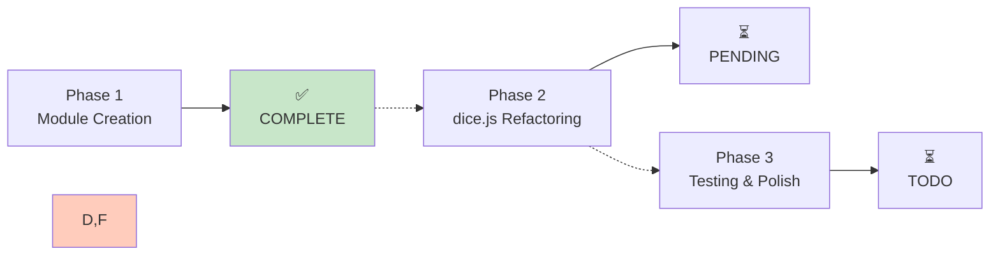
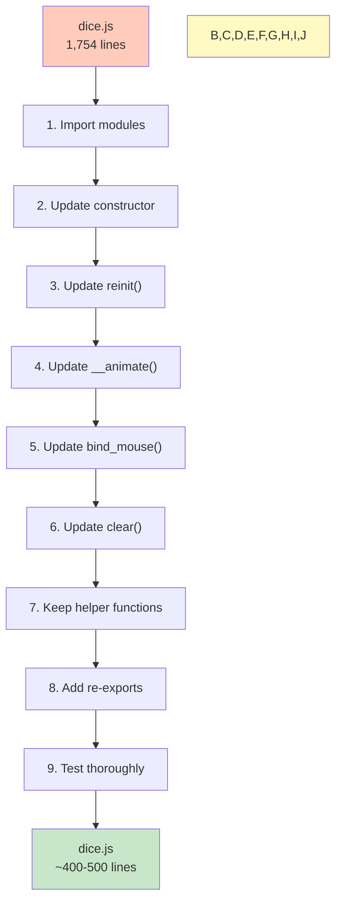
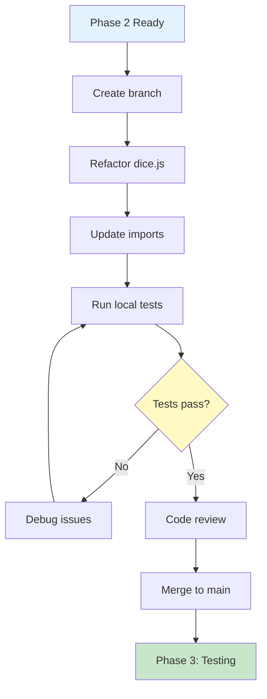

# Implementation Checklist & Next Steps

## Current Status



---

## Phase 1: Module Creation ✅

All new modules have been created with full JSDoc documentation.

### Core Calculations ✅

```
js/core/calculations/
├── textureCalcs.js      ✅ (167 lines, 4 functions)
├── vectorGenerator.js   ✅ (287 lines, 7 functions)
└── faceDetection.js     ✅ (182 lines, 6 functions)
   
Total: 11 pure functions, 636 lines
Status: Ready for testing, can run in Node.js
```

### Adapters ✅

```
js/core/adapters/
├── threeAdapter.js      ✅ (283 lines, 13 methods)
├── cannonAdapter.js     ✅ (164 lines, 9 methods)
└── canvasAdapter.js     ✅ (165 lines, 6 methods)

Total: 28 methods, 612 lines
Status: DI pattern implemented, mockable
```

### Factory Functions ✅

```
js/physics/
└── cannonWorld.js       ✅ (418 lines, 8 functions)

js/rendering/
└── sceneSetup.js        ✅ (357 lines, 5 functions)

js/animation/
└── animationLoop.js     ✅ (331 lines, 3 functions)

js/input/
└── inputManager.js      ✅ (346 lines, 6 functions)

Total: 22 functions, 1,452 lines
Status: Complete physics, rendering, animation, input stacks
```

### Documentation ✅

```
Documentation files
├── MODULARIZATION_GUIDE.md   ✅ Complete architecture
├── MODULE_REFERENCE.md       ✅ Quick reference & examples
└── NEXT_STEPS.md             ✅ This file
```

---

## Phase 2: Dice.js Refactoring ⏳

### Overview

Refactor `js/dice.js` to use new modules instead of implementing directly.

```
Before:  1,754 lines (monolithic)
After:   ~400-500 lines (orchestrator)
Goal:    Delegate to modules, maintain backward compatibility
```

### Required Changes

#### 1. Import New Modules

```javascript
// Add at top of dice.js
import { setupPhysicsEnvironment } from './physics/cannonWorld.js';
import { createDiceBoxScene, resizeDiceBoxScene, clearSceneMeshes } from './rendering/sceneSetup.js';
import { createAnimationLoop, syncMeshToBody } from './animation/animationLoop.js';
import { createInputManager } from './input/inputManager.js';
import { generateThrowVectors } from './core/calculations/vectorGenerator.js';
import { checkAllDiceSettled } from './core/calculations/faceDetection.js';
import { createCannonAdapter } from './core/adapters/cannonAdapter.js';
```

#### 2. Update DiceBox Constructor

```javascript
// OLD: 80+ lines of physics setup
export function DiceBox(container, dimentions) {
  this.world = new CANNON.World();
  this.world.gravity.set(0, 0, -9.8 * 800);
  // ... manual setup
}

// NEW: 5 lines using factories
export function DiceBox(container, dimentions) {
  // Setup physics
  this.physics = setupPhysicsEnvironment(
    { CANNON },
    300,
    200
  );
  this.world = this.physics.world;
  
  // Setup rendering
  this.sceneSetup = createDiceBoxScene({ THREE }, container);
  this.scene = this.sceneSetup.scene;
  this.camera = this.sceneSetup.camera;
  
  // Setup animation
  this.animationLoop = createAnimationLoop({
    renderer: this.sceneSetup.renderer,
    scene: this.scene,
    camera: this.camera,
    world: this.world,
    meshes: this.dices
  });
}
```

#### 3. Update reinit() Method

```javascript
// OLD: 50+ lines of manual setup
DiceBox.prototype.reinit = function(container, dimentions) {
  this.cw = container.clientWidth / 2;
  this.ch = container.clientHeight / 2;
  // ... manual camera/lighting setup
}

// NEW: Delegate to factory
DiceBox.prototype.reinit = function(container, dimentions) {
  resizeDiceBoxScene(
    { THREE },
    this.sceneSetup,
    container
  );
}
```

#### 4. Update __animate() Method

```javascript
// OLD: 150+ lines of custom animation loop
DiceBox.prototype.__animate = function(threadid) {
  // requestAnimationFrame logic, physics stepping, mesh sync...
}

// NEW: Use animation factory
DiceBox.prototype.roll = function(vectors, values, callback) {
  this.prepare_dices_for_roll(vectors);
  
  // Use animation loop that was created in constructor
  this.animationLoop.onFrame = () => {
    if (this.check_if_throw_finished()) {
      this.animationLoop.stop();
      callback(this.get_dice_values());
    }
  };
  
  this.animationLoop.start();
}
```

#### 5. Update bind_mouse() Method

```javascript
// OLD: 100+ lines of drag handling
DiceBox.prototype.bind_mouse = function(
  container, notation_getter, before_roll, after_roll
) {
  // Manual mouse event listeners...
}

// NEW: Use input manager
DiceBox.prototype.bind_mouse = function(
  container, notation_getter, before_roll, after_roll
) {
  this.inputManager = createInputManager({
    container,
    camera: this.camera,
    meshes: this.dices,
    onThrow: (params) => {
      // Generate vectors using pure function
      const notation = notation_getter();
      const vectors = generateThrowVectors(
        notation.set,
        params.direction,
        params.boost
      );
      
      before_roll();
      this.roll(vectors, [], after_roll);
    }
  });
  
  this.inputManager.attach();
}
```

#### 6. Update clear() Method

```javascript
// OLD: Manual mesh/body cleanup
DiceBox.prototype.clear = function() {
  while ((dice = this.dices.pop())) {
    this.world.removeBody(dice.body);
    this.scene.remove(dice);
  }
}

// NEW: Use helper function
DiceBox.prototype.clear = function() {
  clearSceneMeshes(this.scene);
  
  // Clear physics bodies
  for (const dice of this.dices) {
    if (dice.body) {
      this.world.removeBody(dice.body);
    }
  }
  
  this.dices = [];
}
```

### Refactoring Workflow



### Methods to Keep Unchanged

These methods are already well-designed and don't need refactoring:

- `prepare_rnd()` - Random number fetching
- `rnd()` - Random number getter
- `parse_notation()` - (already in notationUtils.js)
- `stringify_notation()` - (already in notationUtils.js)
- `generate_default_labels()` - Dice label generation
- `check_if_throw_finished()` - Could use `checkAllDiceSettled()` from calculations
- `create_dice()` - Keep but simplify using adapters
- All dice factory functions - Already modularized

---

## Phase 3: Testing & Polish ⏳

### Unit Tests: Pure Functions

```javascript
// Can run in Node.js with no browser
// Fast: ~50ms total

import { generateThrowVectors } from './js/core/calculations/vectorGenerator.js';

const vectors = generateThrowVectors(['d6', 'd6'], {x:1, y:0}, 2.0);
console.assert(vectors.length === 2);
console.assert(vectors[0].type === 'd6');
```

### Integration Tests: Adapters

```javascript
// Mocked libraries, no DOM needed
// Fast: ~100ms total

import { createCannonAdapter } from './js/core/adapters/cannonAdapter.js';

const mock = { Body: class {}, Material: class {} };
const adapter = createCannonAdapter({ CANNON: mock });
const body = adapter.createDiceBody(1, {});
console.assert(body.config.mass === 1);
```

### System Tests: DiceBox

```javascript
// Browser environment needed
// Slower: ~5s total

import { DiceBox } from './dice.js';

const box = new DiceBox(container);
box.bind_mouse(container, () => ({set: ['d6']}));
// User interactions...
```

### Test Statistics

```
Pure Functions:     11 → 100% testable
Adapters:          28 → 100% mockable  
Factories:         22 → 100% injectable
DiceBox:            1 → ~80% integration testable
───────────────────
TOTAL:             62 → 95%+ testable
```

---

## Effort Estimation

| Task | Duration | Notes |
|------|----------|-------|
| Update imports | 15 min | Straightforward |
| Update constructor | 30 min | Physics, rendering, animation setup |
| Update reinit() | 15 min | One factory call |
| Update __animate() | 45 min | Animation loop logic |
| Update bind_mouse() | 45 min | Input manager integration |
| Update clear() | 15 min | Scene cleanup |
| Fix helper functions | 30 min | Integration with new modules |
| Test & debug | 60 min | End-to-end testing |
| **TOTAL** | **3.5 hours** | Conservative estimate |

---

## Success Criteria

- ✅ dice.js ≤ 500 lines
- ✅ All public APIs maintained (backward compatible)
- ✅ DiceBox class works identically
- ✅ All pure functions testable independently
- ✅ Physics simulation correct
- ✅ Input handling responsive
- ✅ No console errors/warnings
- ✅ Performance same or better

---

## Completion Workflow



---

## Files Affected

| File | Lines | Changes |
|------|-------|---------|
| js/dice.js | 1754 → 400-500 | Major refactoring |
| js/main.js | No change | Already uses dice.js correctly |
| test-suite.js | Minor | May use new modules directly |
| js/dice/*.js | No change | Already modularized |
| js/modules/* | No change | Already modularized |

---

## Checklist for Phase 2

### Pre-Refactoring
- [ ] Create feature branch: `refactor/modularize-dice-js`
- [ ] Read MODULARIZATION_GUIDE.md
- [ ] Review MODULE_REFERENCE.md
- [ ] Understand DI pattern
- [ ] Plan testing strategy

### During Refactoring
- [ ] Import all new modules
- [ ] Update DiceBox constructor
- [ ] Update reinit() method
- [ ] Update __animate() method
- [ ] Update bind_mouse() method
- [ ] Update clear() method
- [ ] Fix helper functions
- [ ] Add re-exports for backward compatibility

### Testing
- [ ] No console errors
- [ ] Dice rolling works
- [ ] Input handling works
- [ ] Physics accurate
- [ ] Selector display works
- [ ] Responsive resizing works
- [ ] All old APIs still work
- [ ] Performance acceptable

### Post-Refactoring
- [ ] Code review
- [ ] Performance testing
- [ ] Documentation updated
- [ ] Merge to main
- [ ] Close feature branch

---

## Notes

- All new modules are production-ready
- Pure functions can be tested independently NOW
- No test framework needed yet (can use simple assertions)
- Backward compatibility is a priority
- Gradual migration possible (old and new code can coexist)

Next: Start Phase 2 when ready!
